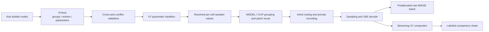

# 开发与架构

[返回中文 README](README.md) | [English README](README_EN.md)

本文面向继续开发节点、轴构造器、采样参数处理器、合成器和前端扩展的维护者。用户安装与工作流说明见 [README](README.md)。

## 设计目标

- 轴生产者只描述“每个条目修改什么”和“图表如何显示”，不实现采样循环。
- 采样器负责参数合并、冲突检查、MODEL/CLIP 分组、提示词路由、采样和输出顺序。
- 合成器只消费轴标签、分组和详情块，不理解提示词、种子或 LoRA 的业务语义。
- 新增轴类型时，尽量只增加构造器和参数处理器，不改笛卡尔积、图片顺序或拼图核心。
- Python、前端和本地化共同维护稳定的工作流序列化契约。
- 大矩阵按格解码并流式提交；只保留必要的最终画布和 `raw_images` 批次。

## 总体数据流



`XY Test Sampler` 的逻辑顺序是：验证单 latent 和轴类型 -> 检查双轴参数冲突 -> 估算矩阵风险 -> 解析每格参数 -> 按 LoRA Stack 签名组织 MODEL/CLIP 复用 -> 路由画师与编码提示词 -> 采样和解码 -> 同时写入原始批次与拼接会话。

## 模块职责

| 路径 | 职责 | 修改时重点 |
|---|---|---|
| `__init__.py` | ComfyUI 入口，导出节点映射和 `WEB_DIRECTORY`。 | 保持导入轻量；外部可选插件缺失时必须可加载。 |
| `lora_tester/nodes.py` | 节点契约、参数处理注册表、采样编排、LoRA 缓存、ComfyUI API 适配。 | 不把轴展示逻辑写入采样循环；所有用户输入都要有后端校验。 |
| `lora_tester/xy.py` | `XYAxis`、`AxisEntry`、`AxisParameter`、`DetailBlock` 及内置轴构造器。 | 这是轴生产者与采样器之间的稳定边界。 |
| `lora_tester/xy_compositor.py` | 通用 XY 布局、分组间距、轴标签、分类表格/文字详情和流式贴图。 | 不依赖具体轴参数名称；避免复制整张画布。 |
| `lora_tester/stack.py` | LoRA/画师 Stack 值对象、签名、列表合并和组合拆分。 | 签名会影响模型 patch 复用与缓存失效。 |
| `lora_tester/artist.py` | 画师 Tag 解析、模型族判断、模板渲染和外部 Mixer 路由。 | 外部依赖必须延迟解析；普通提示词不可被隐式抽取。 |
| `lora_tester/styles.py` | 颜色、字体、背景和 `StyleDecorator` 注册。 | 样式不得改变采样数据或原始图片。 |
| `lora_tester/layout.py` | 专用 1-3 LoRA 测试的任务与画布布局计划。 | `plan.tasks` 是唯一采样队列，画布复用位置不是额外任务。 |
| `lora_tester/compositor.py` | 专用 LoRA 对比图合成与流式会话。 | 保留任务 ID、复用坐标和内存所有权。 |
| `lora_tester/stack_compositor.py` | 旧组合矩阵/独立 Python API 的兼容合成器。 | 通用 XY 不应重新依赖其业务特定布局。 |
| `lora_tester/comfy_adapter.py` | PIL、NumPy、Torch/Comfy IMAGE 之间的转换与批次提交。 | 保持 `[B,H,W,C]` 契约及五维 VAE 输出兼容。 |
| `lora_tester/node_contract.py` | 稳定控件定义与序列化枚举。 | 变更前检查旧工作流和 i18n。 |
| `web/lora_tester.js` | Node 2.0/旧 LiteGraph 动态输入、状态同步、禁用提示和警告。 | 前端仅增强交互，不能成为唯一校验层。 |
| `locales/en`, `locales/zh` | ComfyUI 原生节点与界面本地化。 | 两种语言同步修改，键与注册名保持一致。 |
| `tests/` | 数据模型、节点、合成器、前端契约、缓存和画师路由回归测试。 | 按变更边界扩充，不依赖真实 GPU 的部分应可离线运行。 |
| `scripts/` | 环境检查、测试、预览渲染、开发联接和画师审计。 | 默认路径可通过脚本参数覆盖。 |

## 节点注册契约

当前必须注册 15 个键。显示名可以本地化，注册键不能因界面重命名而改变。

| 注册键 | Python 类 | 默认分类 |
|---|---|---|
| `LoraTesterSampler` | `LoraTesterSampler` | `Lora Tester` |
| `LoraTesterStyle` | `LoraTesterStyleNode` | `Lora Tester` |
| `ArtistTagTemplate` | `ArtistTagTemplateNode` | `Lora Tester/Artist Tags` |
| `AnimaArtistMixerConfig` | `AnimaArtistMixerConfigNode` | `Lora Tester/Artist Tags` |
| `LoraStack` | `LoraStackNode` | `Lora Tester/Stacks` |
| `LoraStackSplitter` | `LoraStackSplitterNode` | `Lora Tester/Stacks` |
| `LoraStackLister` | `LoraStackListerNode` | `Lora Tester/Stacks` |
| `MultiPromptSample` | `MultiPromptSampleNode` | `Lora Tester/Deprecated` |
| `LoraTesterXYSampler` | `XYTestSampler` | `Lora Tester/XY` |
| `LoraTesterMultiPromptInput` | `MultiPromptInputNode` | `Lora Tester/XY/Axes` |
| `LoraTesterGlobalPromptAppend` | `GlobalPromptAppendNode` | `Lora Tester/XY/Axes` |
| `LoraTesterPromptAxis` | `PromptAxisNode` | `Lora Tester/XY/Axes` |
| `LoraTesterLoraStackAxis` | `LoraStackAxisNode` | `Lora Tester/XY/Axes` |
| `LoraTesterSeedList` | `SeedListNode` | `Lora Tester/XY/Axes` |
| `LoraTesterSeedAxis` | `SeedAxisNode` | `Lora Tester/XY/Axes` |

`MultiPromptSample` 已设置 `DEPRECATED = True`，但必须保留原注册键、输入名称和可加载行为。移入 Deprecated 分类不是删除授权。

同样需要稳定的类型与输出包括：

- `XY_AXIS`、`LORA_STACK`、`LORA_STACK_LIST`、`ARTIST_TAG_TEMPLATE`、`ANIMA_ARTIST_MIXER_CONFIG`、`LORA_TESTER_STYLE`。
- `XYTestSampler.RETURN_NAMES = ("comparison_sheet", "raw_images")`。
- `raw_images` 的顺序固定为行优先 `(y, x)`。
- `color_mode` 的序列化值固定为 `black / white / custom`。
- 画师模式的序列化占位值固定为 `__lora_tester_artist_tag__`。

## XY 数据契约

`lora_tester.xy` 中的冻结数据类是跨节点边界：

```text
XYAxis
  title
  groups[]                 # 分组决定轴上的额外间隔
    AxisEntry[]            # 一行或一列对应一个条目
      label                # 轴上的短标签
      detail_label         # 可选的完整说明
      parameters[]         # 当前条目要覆盖的采样数据
        AxisParameter
          name
          value
  detail_blocks[]          # 底部分类表格或纯文字
    DetailBlock
```

`XYAxis.data` 明确暴露三层队列：

```text
groups -> entries -> parameters
```

重要不变量：

- `title` 和每个 `AxisEntry.label` 非空。
- 轴必须至少包含一个非空分组，总条目数不超过 `MAX_AXIS_ENTRIES`（当前为 64）。
- 同一 `AxisEntry` 不能重复赋值同一个参数。
- `table` 详情必须有表头，且每行列数与表头一致；`text` 详情至少有一行。
- `parameter_names` 是整个轴可能修改的参数集合，用于执行前冲突检查。
- `group_breaks` 只影响视觉间隔，不改变条目顺序或 `raw_images` 顺序。

双轴合并必须通过 `merge_axis_parameters()` 或等价的同名冲突检查。X/Y 只要有任意相同参数名就应整轮拒绝，不能采用“后者覆盖前者”，否则同一工作流的含义会随轴方向变化。

### 参数处理注册表

`nodes.py` 中的 `register_xy_parameter_handler(name, handler)` 把轴数据映射为每格采样配置。内置名称为：

| 参数名 | 目标 |
|---|---|
| `prompt` | 正面提示词、全局前后缀和独立画师 Tag。 |
| `seed` | 64 位非负种子。 |
| `lora_stack` | 当前格的 LoRA/画师 Stack。 |
| `steps` | 采样步数，`1..10000`。 |
| `cfg` | CFG，`0..100`。 |
| `sampler_name` | ComfyUI 采样器名称。 |
| `scheduler` | ComfyUI 调度器名称。 |
| `denoise` | 降噪强度，`0..1`。 |

注册表是可扩展点，不是跳过验证的入口。处理器必须把输入转换为明确类型并验证范围；未知参数应报错，而不是静默忽略。

## 新增轴类型

已有参数的新轴只需要构造 `XYAxis`。例如增加 CFG 轴时可复用现有 `cfg` 处理器：

```python
from lora_tester.xy import AxisEntry, AxisParameter, DetailBlock, XYAxis


def build_cfg_axis(values: tuple[float, ...]) -> XYAxis:
    entries = tuple(
        AxisEntry(
            label=f"CFG {value:g}",
            parameters=(AxisParameter("cfg", value),),
        )
        for value in values
    )
    return XYAxis(
        title="CFG",
        groups=(entries,),
        detail_blocks=(
            DetailBlock(
                title="CFG VALUES",
                mode="table",
                headers=("INDEX", "CFG"),
                rows=tuple((str(index), f"{value:g}") for index, value in enumerate(values, 1)),
            ),
        ),
    )
```

新增全新参数语义时按以下顺序实现：

1. 选择稳定、方向无关的参数名，并明确值类型、范围和是否影响 MODEL/CLIP 分组。
2. 在 `nodes.py` 注册后端处理器；不要仅在构造器或前端验证。
3. 在 `xy.py` 或独立领域模块中生成 `AxisEntry`、`AxisParameter` 和必要的 `DetailBlock`。
4. 添加返回 `XY_AXIS` 的 ComfyUI 节点，并更新 `NODE_CLASS_MAPPINGS`、`NODE_DISPLAY_NAME_MAPPINGS` 和导出列表。
5. 同步 `locales/en` 与 `locales/zh`。若该参数对应采样器基础控件，在 `web/lora_tester.js` 中增加禁用/来源提示映射。
6. 测试构造器边界、X/Y 冲突、处理器范围、输出顺序、工作流恢复和前端契约。
7. 更新中英文 README 的节点表和限制说明；若影响稳定契约，同时更新本文。

参数如果会改变 MODEL 或 CLIP，必须纳入复用签名。否则不得把 patched 对象跨不同参数条目复用。仅影响 seed、steps、CFG、采样器、调度器或 denoise 的参数可以在同一个模型分组内逐格解析。

## 采样与输出边界

基础采样控件是在对应轴没有赋值时的 fallback。前端能识别 Prompt/Seed/LoRA/Steps/CFG/Sampler/Scheduler/Denoise 轴时会禁用对应控件并标注来源，但后端仍需独立完成：

- `x_axis` / `y_axis` 类型检查。
- 双轴参数名交集检查。
- 每格值类型与范围检查。
- 单 latent 检查。
- 最终画布像素上限检查。

`raw_images` 在已知总格数后一次预分配，并逐格写入；它与拼接图是两个独立输出。拼图会话持有一张目标 RGB 画布，每格解码图贴入后不再保存源图，`finalize()` 不应复制完整画布。不要恢复“每贴一格创建一张新大图”的实现，这会让旧画布在分配峰值期间与新画布同时驻留。

`max_canvas_megapixels` 只保护带标签拼接图，不限制 `raw_images`。CPU 内存近似随 `x_count * y_count * image_width * image_height * channels` 增长；因此大轴与大 latent 的风险警告不能用提高画布上限消除。

## ComfyUI 接口

采样路径当前依赖以下 ComfyUI API：

- `folder_paths.get_filename_list("loras")`：LoRA 下拉列表。
- `folder_paths.get_full_path_or_raise("loras", name)`：安全解析 LoRA 文件。
- `comfy.utils.load_torch_file(..., safe_load=True, return_metadata=True)`：读取 LoRA state dict 与元数据。
- `comfy.sd.load_lora_for_models(...)`：分别 patch MODEL 与 CLIP。
- `clip.tokenize()`、`clip.encode_from_tokens_scheduled()`：节点内提示词编码。
- `nodes.common_ksampler()` 或等价采样调用：传入 seed、noise、latent 和采样参数。
- `vae.decode(samples["samples"])`：节点内 VAE 解码；五维结果按 ComfyUI `VAEDecode` 行为压平。
- `comfy.model_management.unload_model_and_clones()`：释放本节点创建的临时 patcher 引用。
- `comfy.utils.ProgressBar` 与中断检查：整轮矩阵进度和用户取消。

这些 API 不是本项目可随意重新定义的抽象。升级 ComfyUI 后优先用启动级检查和真实 `INPUT_TYPES` 调用验证兼容性。

## 前端与 Node 2.0

`web/lora_tester.js` 是原生 ES 模块，无 npm 构建步骤。它同时覆盖 Node 2.0 和旧 LiteGraph 的创建、工作流恢复、分页切换与连接变化生命周期。

当前职责包括：

- 按 `lora_count`、Prompt/Stack 数量隐藏和恢复动态输入，保持节点尺寸稳定。
- 为 `LoRA Stack Lister` 自动显示下一个连接槽。
- 保留其他设备缺失的已保存 LoRA combo 值，便于用户替换。
- 在 LoRA 与画师模式之间切换字段显示名，但不改变序列化值。
- 根据可识别的轴来源禁用采样器 fallback 控件。
- 在能推断矩阵规模时显示非阻断风险警告。
- 在外部 Anima Mixer 缺失且功能启用时显示兼容性提示。

前端隐藏、禁用和警告都只是交互增强。工作流可能通过 API 执行，也可能来自旧版本或未加载前端扩展，因此不能依赖 JavaScript 保证数据正确。

## i18n 规则

- 新节点、输入、输出、描述和枚举显示文本同步更新 `locales/en` 与 `locales/zh`。
- 注册键、输入字段名、返回类型和枚举序列化值不翻译。
- JavaScript 生成的动态标签使用同一语言来源，避免另建第三套不受测试约束的文案表。
- 缺失的本地化应回退到稳定英文显示名，不能导致控件查找或工作流恢复失败。
- 修改后运行 `tests/test_frontend_contract.py` 和完整测试，检查 locale 节点集合与 Python 映射一致。

## 画师路由与外部兼容

Anima 判断读取 `model.model.model_config.unet_config["image_model"]`，不得根据 checkpoint 文件名猜测。外部兼容通过 `nodes.NODE_CLASS_MAPPINGS` 延迟解析 `AnimaArtistPack` 与 `AnimaArtistAdapterMixer`，缺少外部项目时本插件仍须可导入和执行。

只有显式画师模式项和独立画师字段进入画师计数。普通提示词与 LoRA 触发词中的 `@tag` 留在 `base_prompt`，不得自动抽取。关闭 `use_anima_artist_mixer`、配置 `enabled=false` 或 `strength=0` 时，应在查询外部节点前短路到原生编码。

日志中的边界：

- `run-local:miss/hit` 只描述本节点的 CPU LoRA state-dict LRU。
- `column reuse` 或模型分组复用只描述相同 Stack 签名下的 patched MODEL/CLIP。
- `external:lazy-per-sample` 只说明外部 Mixer 管理自身 embedding 生命周期，本项目不能声称跨格缓存命中。

不要把 `(@artist:weight)` 的 post-Adapter 差分视为可缩放单位效果。真实模型验证见 [Anima 画师权重线性审计](audit/anima_artist_linearity.md)；当前架构明确不实现此类跨格画师效果缓存。生产路由分支见 [画师路由审计](audit/artist_routing_report.md)。

## 缓存与内存所有权

- LoRA state dict 作为 CPU 数据进入运行内 LRU，上限为 3，键包含规范化路径和文件 stat 指纹。
- 缓存在成功、异常或用户中断后清空，不持有 MODEL、CLIP、conditioning、latent、图片或外部 Mixer 对象。
- 相同 LoRA Stack 签名可在一个采样分组中复用 patched MODEL/CLIP；不同签名不得共享。
- 本节点创建的临时 MODEL/CLIP clone 和画师路由必须在对应 `finally` 中释放，基础输入对象不得直接作为卸载目标。
- MODEL/CLIP clone 的设备调度、外部 Mixer GPU 状态和 clone 组淘汰由 ComfyUI/外部插件负责。
- 不调用全局 `gc.collect()`、`torch.cuda.empty_cache()`，也不修改 ComfyUI RAM/VRAM 上限或 DynamicVRAM 策略。
- AIMDO/DynamicVRAM 的 `hostbuf_grow ... beyond reserved host buffer` 可能是 pinned host buffer 压力提示。先确认本节点临时 clone 已按格/组释放，再排查其他节点、ComfyUI/AIMDO 版本和启动参数。

## 样式扩展

自定义样式通过 `StyleConfig` 传递。第三方装饰器实现 `StyleDecorator` 的两个方法，并注册稳定名称：

```python
from lora_tester import register_style_decorator

register_style_decorator("project_name", decorator_instance)
```

- `draw_background(context)` 在网格、图片和文字之前绘制。
- `draw_foreground(context)` 在主要内容之后绘制。
- 装饰器只能绘制，不得修改采样任务、轴条目或图片序列。
- 新装饰器名称一旦进入工作流即视为序列化值；重命名时需要兼容别名。

## 本地开发基线

以下是当前已验证环境，不是强制的最低硬件要求。Python 包最低范围见 `pyproject.toml`。

| 项目 | 已验证值 |
|---|---|
| ComfyUI | `0.33.0`，提交 `aaabf342`，2026-08-15 |
| ComfyUI 前端 | `1.49.6` |
| ComfyUI 路径 | `D:\ComfyUI\ComfyUI_windows_portable\ComfyUI` |
| 插件开发路径 | `D:\ComfyUI\LoraTester` |
| 便携 Python | `3.13.14` |
| Torch | `2.13.0+cu130` |
| CUDA / GPU | CUDA 13.0 / NVIDIA GeForce RTX 2080 Ti |
| Pillow / NumPy | `12.3.0` / `2.5.1` |

项目声明 Python `>=3.10`、NumPy `>=1.26,<3`、Pillow `>=10,<13`。开发、测试与预览优先使用运行 ComfyUI 的解释器；系统 Python 可能缺少 Torch 或 ComfyUI 模块。

目录联接：

```powershell
powershell.exe -NoProfile -ExecutionPolicy Bypass -File .\scripts\link_to_comfy.ps1
```

默认目标为：

```text
D:\ComfyUI\ComfyUI_windows_portable\ComfyUI\custom_nodes\LoraTester
  -> D:\ComfyUI\LoraTester
```

脚本只在目标不存在时创建 Junction，不会覆盖已有目录。使用其他便携版位置时传入 `-ComfyPortable`。

## 测试与预览

完整测试：

```powershell
powershell.exe -NoProfile -ExecutionPolicy Bypass -File .\scripts\run_tests.ps1
```

视觉预览与环境检查：

```powershell
powershell.exe -NoProfile -ExecutionPolicy Bypass -File .\scripts\render_previews.ps1
powershell.exe -NoProfile -ExecutionPolicy Bypass -File .\scripts\check_environment.ps1
```

画师路由审计：

```powershell
D:\ComfyUI\ComfyUI_windows_portable\python_embeded\python.exe .\scripts\generate_artist_audit.py
```

测试分层建议：

- 值对象/轴构造器：`test_xy.py`、`test_stack.py`、`test_artist.py`。
- 参数、缓存、采样与兼容节点：`test_nodes.py`、`test_node_contract.py`、`test_stack_nodes.py`。
- 通用与专用合成：`test_compositor.py`、`test_layout.py`、`test_comfy_adapter.py`。
- Node 2.0、动态控件和 i18n 契约：`test_frontend_contract.py`。
- 审计数据稳定性：`test_artist_audit.py`。

## ComfyUI 启动级检查

只加载本插件并使用内存数据库，避免与正在运行的 ComfyUI 争用数据库：

```powershell
Set-Location D:\ComfyUI\ComfyUI_windows_portable\ComfyUI
..\python_embeded\python.exe main.py --quick-test-for-ci --disable-all-custom-nodes --whitelist-custom-nodes LoraTester --database-url "sqlite:///:memory:"
```

预期条件：退出码为 0、插件导入成功、节点映射数量为 15，并且实际 `INPUT_TYPES` 构造不报错。外部 Anima Artist Mixer 未安装时也应满足这些条件。

## 变更检查表

提交节点或架构变更前检查：

1. Python 节点映射、显示名、根包导出是否同步。
2. 旧注册键、输入名、序列化枚举和返回顺序是否保持兼容。
3. 双轴同参数冲突和所有输入范围是否有后端验证。
4. 新参数是否正确参与 MODEL/CLIP 复用签名。
5. Node 2.0 与旧 LiteGraph 的创建、恢复、分页切换和动态连接是否正常。
6. `locales/en` 与 `locales/zh` 是否同时更新。
7. 大 latent、大轴、画布上限、异常与中断路径是否释放临时对象。
8. `raw_images` 是否仍为行优先，拼图分组是否只影响显示。
9. `git diff --check`、完整测试、必要的预览和启动级检查是否通过。
10. README、本文和审计记录是否反映新的用户行为与稳定边界。
