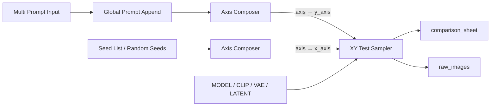

# ComfyUI LoRA Tester

[简体中文](README.md) | [English](README_EN.md)

面向 ComfyUI 的 LoRA、画师 Tag 与通用 XY 参数测试节点。采样器直接接收 `MODEL / CLIP / VAE / LATENT`，在节点内完成提示词编码、模型/CLIP 处理、采样、VAE 解码和带标注的对比图合成。


## 核心能力

- 通用 `XY Test Sampler`：组合任意两个 `XY_AXIS`，输出带标注的 `comparison_sheet` 和按行优先排列的原始图片批次 `raw_images`。
- 提示词轴：拆分长文本、统一前置或后置追加提示词，并单独传递画师 Tag。
- 种子轴：解析显式种子列表，或根据来源种子确定性生成一组随机种子。
- 风格轴：从风格组合、组合拆分和列表汇总节点构造轴，统一表示 LoRA 与画师 Tag，顶部显示“权重-代号”组合，底部只列出代号对应的来源信息。
- 通用轴合成：提示词列表、风格组合、风格组合列表和种子列表均可经 `Axis Composer` 转换为方向无关的 `XY_AXIS`。
- 专用 LoRA 测试：保留 1 至 3 个 LoRA 的权重梯度与混合布局。
- Anima 兼容：按模型配置选择画师 Tag 模板，并可选接入 Anima Artist Mixer 处理多画师组合。
- 可定制输出：黑色、白色或自定义主题，支持背景图、字体、颜色、间距、装饰器、分类表格和文字说明。
- 双语节点界面：通过 ComfyUI 原生 `locales` 提供简体中文与 English。

## 推荐工作流

最常用的“提示词 Y 轴 + 种子 X 轴”连接方式：



画风横向测试可使用：

```text
Style Stack -> Style Stack Splitter / Style Stack Lister -> Axis Composer -> axis -> x_axis
Multi Prompt Input -> Global Prompt Append                    -> Axis Composer -> axis -> y_axis
```

所有轴节点的输出均名为 `axis`，轴本身不绑定方向，可自由接入采样器的 `x_axis` 或 `y_axis`。`axis_title` 是整条轴的总标题；每行或每列顶端显示的文字来自各个 `AxisEntry.label`。`Axis Composer` 的 `include_base` 可将风格 BASE 放入单独分组，使基线列与其余测试列之间自动留出间隔。`Prompt Axis`、`Style Axis` 和 `Seed Axis` 仍作为对应数据类型的快捷构造器提供。

## 安装

在 ComfyUI 的 `custom_nodes` 目录克隆仓库：

```powershell
Set-Location D:\ComfyUI\ComfyUI_windows_portable\ComfyUI\custom_nodes
git clone https://github.com/Mon-Landis/LoraTester.git
..\..\python_embeded\python.exe -s -m pip install -r .\LoraTester\requirements.txt
```

其他安装方式使用运行 ComfyUI 的 Python 执行：

```bash
python -m pip install -r ComfyUI/custom_nodes/LoraTester/requirements.txt
```

安装或更新 Python、`web`、`locales` 文件后，重启 ComfyUI 后端并刷新浏览器。LoRA 文件需要位于 ComfyUI 已配置的 `models/loras` 目录。

仓库外开发可使用目录联接；脚本只在目标不存在时创建联接，不会覆盖已有目录：

```powershell
powershell.exe -NoProfile -ExecutionPolicy Bypass -File .\scripts\link_to_comfy.ps1
```

## 节点概览

| 分类 | 节点 | 用途 |
|---|---|---|
| `Lora Tester/XY` | `XY Test Sampler` | 对两个轴做笛卡尔积采样，输出拼接图与原始图片批次。 |
| `Lora Tester/XY/Prompt` | `Multi Prompt Input` | 通过数量控制和独立输入框构造多提示词列表。 |
| `Lora Tester/XY/Prompt` | `Global Prompt Append` | 为全部提示词统一前置/后置文本，并追加独立画师 Tag。 |
| `Lora Tester/XY/Prompt` | `Prompt Axis` | 将提示词列表直接转换为方向无关的 `XY_AXIS`。 |
| `Lora Tester/XY/Style` | `Style Stack` | 配置最多 16 个 LoRA 或画师 Tag 风格项。 |
| `Lora Tester/XY/Style` | `Style Stack Splitter` | 生成风格组合的全部非空组合。 |
| `Lora Tester/XY/Style` | `Style Stack Lister` | 动态合并最多 16 个独立风格组合。 |
| `Lora Tester/XY/Style` | `Style Axis` | 将风格组合列表直接转换为带分组和详情表的 `XY_AXIS`。 |
| `Lora Tester/XY/Seed` | `Seed List / Random Seeds` | 解析种子列表或确定性生成随机种子。 |
| `Lora Tester/XY/Seed` | `Seed Axis` | 将种子列表直接转换为方向无关的 `XY_AXIS`。 |
| `Lora Tester/XY/Axis` | `Axis Composer` | 将任一受支持的原始数据源或完整轴转换为通用 `axis`。 |
| `Lora Tester` | `Style Component Tester` | 专用的 1 至 3 LoRA 权重与混合测试器。 |
| `Lora Tester` | `LoRA Tester Style` | 为采样器提供自定义视觉样式。 |
| `Lora Tester/Artist Tags` | `Artist Tag Template` | 覆盖普通权重和加权画师 Tag 的格式。 |
| `Lora Tester/Artist Tags` | `Anima Artist Mixer Configuration` | 配置可选的多画师 Anima 路由。 |
| `Lora Tester/Deprecated` | `Style Combination Tester` | 兼容旧工作流的提示词水平测试器；新工作流请使用通用 XY 节点。 |

旧节点 `Style Combination Tester` 已标记为废弃，但注册键和输入仍保留，已有工作流可以继续加载。其内部复用通用 XY 采样核心；不要在新工作流中继续依赖该节点。

## XY 行为与限制

- 每个轴最多 64 个条目。两轴不能同时修改同一个参数，例如同时提供两个种子轴或两个提示词轴；采样器会在加载模型前拒绝冲突。
- 已内置 `prompt`、`seed`、`lora_stack`、`steps`、`cfg`、`sampler_name`、`scheduler` 和 `denoise` 参数处理器。当前界面提供提示词、种子和风格数据源及快捷轴构造器；`Axis Composer` 提供一致的通用入口。
- 轴合成后只允许整轴级操作，不提供单元素二次修改。内部已提供保留分组的轴拼接与带参数冲突检查的交叉合并函数，供后续节点使用。
- 当轴来源可被前端识别时，对应的基础采样控件会被禁用；后端校验始终是最终边界。
- `raw_images` 为 ComfyUI `[N,H,W,C]` IMAGE 批次，顺序是行优先 `(y, x)`，不受分组间距和底部详情布局影响。
- 输入 latent 必须只有一个样本。轴条目过多或 latent 空间过大时会产生非阻断警告；最终拼接图默认受 `150 MP` 的 `max_canvas_megapixels` 限制。
- 原始图片批次会占用 CPU 内存。矩阵规模和单图分辨率较大时，应先减小轴长度或 latent 尺寸，再考虑提高画布上限。
- `extra_footer_text` 非空时会在所有轴详情后增加 `NOTES`；风格轴底部只显示代号来源表，提示词正文不会重复显示。

## 提示词与画师 Tag

`Global Prompt Append` 只把“独立画师 Tag”字段送入画师处理链。普通提示词和 LoRA 触发词中的 `@tag` 会保留在原提示词中，不会被自动抽取。

内置模型判断读取 ComfyUI 已解析的模型配置，而不是 checkpoint 文件名：

| 模型 | 默认格式 |
|---|---|
| Anima | `@{tag}` / `(@{tag}:{weight})` |
| 其他 Danbooru Tag 系模型 | `{tag}` / `({tag}:{weight})` |
| 连接 `Artist Tag Template` | 使用节点中定义的两条模板 |

项目可选兼容 [Anima-Artist-Mixer](https://github.com/An1X3R/Anima-Artist-Mixer)。仅当模型为 Anima、当前测试格至少包含两个显式画师项、Mixer 可用且开关/配置启用时，才调用外部 Mixer；其余情况使用原生提示词编码。外部项目缺失不会阻止本插件导入或执行。

更深入的边界与验证记录：

- [Anima 画师权重线性验证](audit/anima_artist_linearity.md)
- [画师路由审计报告](audit/artist_routing_report.md)

## 专用 LoRA 测试器

`Style Component Tester` 适合快速检查 1 至 3 个 LoRA 的单项权重和混合效果：

| LoRA 数量 | 唯一采样任务 | 画布位置 |
|---:|---:|---:|
| 1 | 5 | 5 |
| 2 | 25 | 25 |
| 3 | 69 | 73，部分单轴图片复用 |

每项使用 `min_strength` 与 `max_strength`，四档倍率为 `0.25 / 0.5 / 0.75 / 1.0`：

```text
actual = min_strength + (max_strength - min_strength) * multiplier
```

实际权重非零时，LoRA 会同时应用到 MODEL 与 CLIP，并将触发词加入正面提示词。低权重格不等于质量下限；稳定的底模参照应使用实际权重为零的 BASE。


## 样式

`color_mode` 支持 `black / white / custom`。使用 `custom` 时连接 `LoRA Tester Style`，可配置背景颜色或单张背景 `IMAGE`、背景适配、文字/边框/A-B-C 功能色、间距、字体和装饰器。样式只影响拼接图，不改变 `raw_images`。

Python 侧也可通过 `register_style_decorator()` 注册实现 `draw_background()` 与 `draw_foreground()` 的装饰器。详细模块边界和 API 见 [开发与架构文档](DEVELOPMENT.md)。

## 开发与验证

```powershell
powershell.exe -NoProfile -ExecutionPolicy Bypass -File .\scripts\run_tests.ps1
powershell.exe -NoProfile -ExecutionPolicy Bypass -File .\scripts\render_previews.ps1
powershell.exe -NoProfile -ExecutionPolicy Bypass -File .\scripts\check_environment.ps1
```

- [开发与架构文档](DEVELOPMENT.md)
- [预览与测试清单](previews/)
- [三 LoRA 任务清单示例](previews/3_lora_manifest.json)
