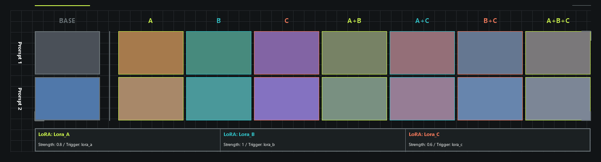
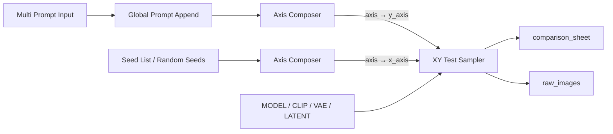

# ComfyUI LoRA Tester

[简体中文](README.md) | [English](README_EN.md)

面向 ComfyUI 的 LoRA、画师 Tag 与通用 XY 参数测试节点。采样器直接接收 `MODEL / CLIP / VAE / LATENT`，在节点内完成提示词编码、模型/CLIP 处理、采样、VAE 解码和带标注的对比图合成。



## 核心能力

- 通用 `XY Test Sampler`：组合任意两个 `XY_AXIS`，输出带标注的 `comparison_sheet` 和按行优先排列的原始图片批次 `raw_images`。
- 提示词轴：拆分长文本、统一前置或后置追加提示词，并单独传递画师 Tag。
- 种子轴：解析显式种子列表，或根据来源种子确定性生成一组随机种子。
- 风格轴：统一表示 LoRA 与画师 Tag；单风格默认显示“代号-名称-权重”，多风格显示“代号-权重”组合，自定义名称优先。底部列出代号对应的来源信息。
- 通用轴合成：提示词列表、StyleStack、StyleStackList和种子列表均可经 `Axis Composer` 转换为方向无关的 `XY_AXIS`。
- 专用 LoRA 测试：保留 1 至 3 个 LoRA 的权重梯度与混合布局。
- Anima 兼容：按模型配置选择画师 Tag 模板，并可选接入 Anima Artist Mixer 处理多画师组合。
- 可定制输出：黑色、白色或自定义主题，支持背景图、字体、颜色、间距、装饰器、分类表格和文字说明。
- 双语节点界面：通过 ComfyUI 原生 `locales` 提供简体中文与 English。

## 推荐工作流

最常用的“提示词 Y 轴 + 种子 X 轴”连接方式：


```mermaid
flowchart LR
  P1["Multi Prompt Input"] --> P2["Global Prompt Append"]
  P2 --> P3["Axis Composer"]
  S1["Seed List / Random Seeds"] --> S2["Axis Composer"]
  P3 -->|axis → y_axis| XY["XY Test Sampler"]
  S2 -->|axis → x_axis| XY
  M["MODEL / CLIP / VAE / LATENT"] --> XY
  XY --> O1["comparison_sheet"]
  XY --> O2["raw_images"]
```

画风横向测试可使用：

```text
StyleStack -> StyleStack Splitter / StyleStack Lister -> Axis Composer -> axis -> x_axis
Multi Prompt Input -> Global Prompt Append                    -> Axis Composer -> axis -> y_axis
```

所有轴节点的输出均名为 `axis`，轴本身不绑定方向，可自由接入采样器的 `x_axis` 或 `y_axis`。`axis_title` 是整条轴的总标题；每行或每列顶端显示的文字来自各个 `AxisEntry.label`。`Axis Composer` 的 `include_base` 可将风格 BASE 放入单独分组，使基线列与其余测试列之间自动留出间隔。`Prompt Axis`、`Style Axis` 和 `Seed Axis` 仍作为对应数据类型的快捷构造器提供。

### 提取与设置 StyleStack

- `提取StyleStack` / `Extract StyleStack`：StyleStackList + 索引 → 完整的原始 StyleStack。
- `设置StyleStack` / `Set StyleStack`：StyleStackList + StyleStack + 索引 + `前 / 后 / 替换` → 新列表，不修改共享输入。
- 索引从 **0** 开始；**-1 定位末项，-2 定位首项**，非 Python 负索引。`-1 + 前` 插在末项之前，`-1 + 后` 追加，`-1 + 替换` 替换末项。
- 设置：索引超过最大索引（含等于列表长度）或空列表时，三种模式均追加。
- 提取：空列表或越界明确报错，不静默截断；两个节点均拒绝小于 -2 的索引。
- 名称、权重、触发词、画师模板及独立 Mixer 强度完整保留；重复元素不去重。轴 `BASE` 不属于此列表。
- 兼容性：前端统一为 **StyleStack / StyleStackList**；内部类、旧节点 ID、端口标识和 `LORA_STACK` / `LORA_STACK_LIST` 类型保留，旧工作流不必迁移。列表命名节点原有“任意负数 = 全部”的规则不变。

### 种子列表的使用

在 `Seed List / Random Seeds` 节点中选择“指定列表”，然后在“种子列表”里输入十进制非负整数；可用英文逗号、空格或换行分隔，例如 `1, 42, 123456`。输入顺序就是轴上的顺序，每个值对应一行或一列。将节点输出接入 `Seed Axis` 的 `seed_list`，或直接接入 `Axis Composer` 的 `source`，再把生成的 `axis` 接到 `XY Test Sampler` 的 `x_axis` 或 `y_axis`。

选择“确定性随机生成”时，“随机种子数量”控制轴长度；相同的“生成器种子”会得到相同的种子序列，便于复现。将“生成器种子”设为 `-1` 会在每次执行时随机选择新的生成器种子，因此生成的序列不再可复现。

## 安装

在 ComfyUI 的 `custom_nodes` 目录克隆仓库：

```powershell
Set-Location D:\ComfyUI\ComfyUI_windows_portable\ComfyUI\custom_nodes
git clone https://github.com/Mon-Landis/LoraTester.git
..\..\python_embeded\python.exe -s -m pip install -r .\LoraTester\requirements.txt
```

其他安装方式使用运行 ComfyUI 的 Python 执行：

```bash
python -m pip install -r ComfyUI/custom_nodes/LoraTester/requirements.txt
```

安装或更新 Python、`web`、`locales` 文件后，重启 ComfyUI 后端并刷新浏览器。LoRA 文件需要位于 ComfyUI 已配置的 `models/loras` 目录。

仓库外开发可使用目录联接；脚本只在目标不存在时创建联接，不会覆盖已有目录：

```powershell
powershell.exe -NoProfile -ExecutionPolicy Bypass -File .\scripts\link_to_comfy.ps1
```

## 节点概览

| 分类 | 节点 | 用途 |
|---|---|---|
| `Lora Tester/XY` | `XY Test Sampler` | 对两个轴做笛卡尔积采样，输出拼接图与原始图片批次。 |
| `Lora Tester/XY/Prompt` | `Multi Prompt Input` | 通过数量控制和独立输入框构造多提示词列表。 |
| `Lora Tester/XY/Prompt` | `Global Prompt Append` | 为全部提示词统一前置/后置文本，并追加独立画师 Tag。 |
| `Lora Tester/XY/Prompt` | `Prompt List Name` / `提示词组命名` | 按多行文本的位置为提示词组逐项命名，空行或缺少的行恢复默认名称。 |
| `Lora Tester/XY/Prompt` | `Prompt Axis` | 将提示词列表直接转换为方向无关的 `XY_AXIS`。 |
| `Lora Tester/XY/Style` | `StyleStack` | 配置最多 16 个 LoRA 或画师 Tag 风格项。 |
| `Lora Tester/XY/Style` | `Artist Tag Text Parser` / `画师 Tag-文本解析` | 将画师提示词文本解析为含权重的StyleStack。 |
| `Lora Tester/XY/Style` | `Artist Tag Replacer` / `画师替换` | 精确匹配画师并替换为画师或 LoRA，支持替换权重与倍率。 |
| `Lora Tester/XY/Style` | `StyleStack Splitter` | 生成StyleStack的全部非空组合。 |
| `Lora Tester/XY/Style` | `StyleStack Flattener` / `StyleStack平铺` | 将组合平铺为独立单项，可选择在首位加入原始组合。 |
| `Lora Tester/XY/Style` | `StyleStack Name` / `StyleStack命名` | 设置单个组合的字面名称，留空恢复自动命名。 |
| `Lora Tester/XY/Style` | `StyleStack Anima Mixer Strength` / `StyleStack Anima 混合强度` | 为单个组合设置最高优先级的 Mixer 强度；仅满足原 Mixer 路由条件时生效。 |
| `Lora Tester/XY/Style` | `StyleStackList Name` / `StyleStackList命名` | 按索引命名一项或全部，支持 `{i}` 与反斜杠转义。 |
| `Lora Tester/XY/Style` | `Extract StyleStack` / `提取StyleStack` | 按索引提取完整风格；-1 末项、-2 首项。 |
| `Lora Tester/XY/Style` | `Set StyleStack` / `设置StyleStack` | 前/后插入或替换；越界和空列表均追加。 |
| `Lora Tester/XY/Style` | `StyleStack Lister` | 动态合并最多 16 个独立StyleStack。 |
| `Lora Tester/XY/Style` | `Style Axis` | 将StyleStackList直接转换为带分组和详情表的 `XY_AXIS`。 |
| `Lora Tester/XY/Seed` | `Seed List / Random Seeds` | 解析种子列表或确定性生成随机种子。 |
| `Lora Tester/XY/Seed` | `Seed Axis` | 将种子列表直接转换为方向无关的 `XY_AXIS`。 |
| `Lora Tester/XY/Axis` | `Axis Composer` | 将任一受支持的原始数据源或完整轴转换为通用 `axis`。 |
| `Lora Tester/XY/Axis` | `Axis Content Preview` / `轴内容预览` | 将任意完整轴展开为保留分组与缩进的可读文本，同时原样传递轴。 |
| `Lora Tester` | `Style Component Tester` | 专用的 1 至 3 LoRA 权重与混合测试器。 |
| `Lora Tester` | `LoRA Tester Style` | 为采样器提供自定义视觉样式。 |
| `Lora Tester/Artist Tags` | `Artist Tag Template` | 覆盖普通权重和加权画师 Tag 的格式。 |
| `Lora Tester/Artist Tags` | `Anima Artist Mixer Configuration` | 配置可选的多画师 Anima 路由。 |
| `Lora Tester/Deprecated` | `Style Combination Tester` | 兼容旧工作流的提示词水平测试器；新工作流请使用通用 XY 节点。 |

旧节点 `Style Combination Tester` 已标记为废弃，但注册键和输入仍保留，已有工作流可以继续加载。其内部复用通用 XY 采样核心；不要在新工作流中继续依赖该节点。

## XY 行为与限制

- 每个轴最多 64 个条目。两轴不能同时修改同一个参数，例如同时提供两个种子轴或两个提示词轴；采样器会在加载模型前拒绝冲突。
- 已内置 `prompt`、`seed`、`lora_stack`、`steps`、`cfg`、`sampler_name`、`scheduler` 和 `denoise` 参数处理器。当前界面提供提示词、种子和风格数据源及快捷轴构造器；`Axis Composer` 提供一致的通用入口。
- 轴合成后只允许整轴级操作，不提供单元素二次修改。内部已提供保留分组的轴拼接与带参数冲突检查的交叉合并函数，供后续节点使用。
- 当轴来源可被前端识别时，对应的基础采样控件会被禁用；后端校验始终是最终边界。
- `raw_images` 为 ComfyUI `[N,H,W,C]` IMAGE 批次，顺序是行优先 `(y, x)`，不受分组间距和底部详情布局影响。
- 输入 latent 必须只有一个样本。轴条目过多或 latent 空间过大时会产生非阻断警告；最终拼接图默认受 `150 MP` 的 `max_canvas_megapixels` 限制。
- 原始图片批次会占用 CPU 内存。矩阵规模和单图分辨率较大时，应先减小轴长度或 latent 尺寸，再考虑提高画布上限。
- `extra_footer_text` 非空时会在所有轴详情后增加 `NOTES`；风格轴底部只显示代号来源表，提示词正文不会重复显示。

### AnimaFlow XY 测试器

`AnimaFlow XY 测试器`（`Lora Tester/XY`）是独立的 f 采测试入口，依赖 [Comfyui-anima-sampler](https://github.com/KeithZ117/Comfyui-anima-sampler) 的 `AnimaFlowCorrectiveSampler`。现有提示词、风格/画师、种子、组合轴和平铺后的风格轴继续使用 `XY_AXIS`；输出仍为对比图和行优先的原始图片批次。

- 求解器、调度器、CFG 模式的选项和数值范围、默认值来自当前外部节点定义，不复制求解器或调度器实现。
- `flow_settings` 可直接连接外部 `Anima Flow Settings`。每个单元格调用外部节点的公开 `sample()`；LoRA/画师路由和图表合成复用 XY 核心，VAE 每格只解码一次。
- 新增 `AnimaFlow 参数轴`（`Lora Tester/XY/Axis`）：选择参数后输入每行一个值或逗号分隔的值。例如 `flow_solver` 填写 `flow_euler, flow_heun`，`flow_shift` 填写 `3, 5`。高级参数列表来自外部 Settings 节点；布尔参数使用 `true/false/1/0`。
- 参数轴覆盖基础配置；高级参数轴只覆盖对应设置，保留其余已连接的设置。可进行交叉合并，也可先接入轴内容预览。
- 原生 `sampler_name`、`scheduler` 不能自动翻译为 Flow 参数；误接时明确报错。普通 XY 测试器也不会接受 Flow 专用参数。
- 缺少依赖或接口不兼容时保留兼容壳，工作流仍可识别节点；显示红色依赖提示和项目链接，执行被阻止，绝不回退到 KSampler。安装/更新依赖后重启 ComfyUI 并刷新浏览器。
- f 采的步进进度和实时预览转发到整个 XY 队列：已完成格数 + 当前格的分数进度。每张图不会重新从 0% 开始，保留解码与图表合成时间，合成结束才显示 100%。不修改求解器或模型调用次数；转发只在当前执行上下文内生效，不改写全局进度钩子。

推荐连线：`画师文本解析 -> StyleStack平铺 -> Style Axis -> AnimaFlow XY 测试器.x_axis`，提示词轴接 `y_axis`；比较 Flow 参数时，将 `AnimaFlow 参数轴` 接任一轴。

### 轴内容预览

将任意轴节点的 `axis` 输出接入 `轴内容预览`（`Axis Content Preview`）。支持提示词轴、风格轴、种子轴、组合轴和采用 `XY_AXIS` 类型的自定义轴。执行后，节点内显示制表符缩进与 `├─` / `└─` 分支组成的紧凑元素树，文本可选择、复制和滚动；`预览文本语言` 可选择中文或英文。

- 总览包含轴标题、分组数、总项数和参数名称。
- 按原顺序显示分组，每个轴元素独占一行，标签和全部参数并列展示；BASE 表示沿用基础设置。
- 同一风格元素内的文件、触发词 / 画师 Tag、权重及自定义画师模板都在该行，不再拆成多层字段。提示词显示正文、非空前置 / 后置文本和独立画师 Tag，不重复展开合并正文。
- 种子保留完整整数，嵌套参数紧凑内联。内容中的换行显示为 `⏎`、制表符显示为 `⇥`，不截断正文；详情表每行也只占一行。
- 输出 `axis` 为原轴，输出 `text` 为完整格式化字符串，可串接采样器或文本保存节点。预览结果保存在工作流属性中，保存 / 重载后可继续检查；修改输入后重新执行即可更新。

例如：`Style Axis -> 轴内容预览 -> XY Test Sampler`。本节点只检查轴数据，不加载模型或生成图片；单独连接该输出节点可只运行上游轴构造链路。

### 画师文本解析与替换

`画师 Tag-文本解析` 接收专门的画师文本，例如 `@wlop, (@ask_(askzy):0.55)`，输出一个 `LORA_STACK`：每个画师独立存为画师模式项，未指定权重时使用 `1.0`。支持逗号、中文逗号和换行分隔，保留名称中的括号、顺序、重复项以及可选的画师模板。该字段只用于画师文本，不会从普通提示词中自动提取画师。

`画师替换` 接收一个 `LORA_STACK`；配置一个完整的匹配画师名（可带或不带 `@`），选择替换 LoRA 文件或画师 Tag 模式，填写替换触发词 / 画师 Tag，再设置强度与模式：

- `替换`：匹配项的新权重直接使用配置的强度。
- `倍率`：匹配项的新权重为原权重乘以配置的倍率。例如原权重 `0.3`、倍率 `2`，输出权重 `0.6`。
- 精确匹配、区分大小写，并替换全部匹配项；不会误匹配普通 LoRA 触发词或画师名的子串。无匹配时原样返回。
- 替换物、触发词和强度控件复用 `StyleStack` 构造器的同一代码路径；替换成画师时填写画师 Tag，替换成 LoRA 时填写该文件的触发词。
- 保留未匹配项、顺序与画师模板；一项包含多个画师时只替换匹配画师，其余画师保留原权重。

可连接为 `画师 Tag-文本解析 -> 画师替换 -> StyleStack平铺 -> Style Axis / Axis Composer`。解析输出直接接入轴时代表完整画师组合；通过平铺节点可分别测试每个画师。

### 单组合 Anima 混合强度

`StyleStack Anima 混合强度`（`StyleStack Anima Mixer Strength`，`Lora Tester/XY/Style`）输入和输出均为 `LORA_STACK`。输入 `混合强度`（0–4，默认 1.0）仅为此组合覆盖 Anima Artist Mixer 的 `strength`，优先级为 **组合值 > 采样器手动全局配置 > 默认值**。不覆盖画师各自的权重、归一化、对齐方式、高级选项或 Mixer 启用状态；0 表示对此组合停用混合。

- 仅当 Anima 底模、依赖已安装、至少两个画师（含提示词源独立画师）且 Mixer 路由开启时生效；非 Anima、单画师、缺失依赖或开关关闭仍走原路由，不强制启用。
- 节点缺失依赖时显示警告，组合数据仍正常输出。串联多个此节点时后一个覆盖前一个。
- 名字设置、画师替换、列表收集、排列与平铺保留组合强度；派生单画师通常不会生效，除非与独立画师合计达到多个。不同强度的同内容组合不会共用错误的采样配置。
- 此值不进入输出图行/列标签或来源表，仅在轴内容预览显示以便检查。支持普通 XY、AnimaFlow XY 与旧组合测试入口。

推荐：`画师文本解析 → StyleStack Anima 混合强度 → StyleStackList汇总 → 风格轴 → XY 测试器`。未连接此节点的组合继续使用原全局配置。

### StyleStack命名

- `StyleStack配置`（StyleStack）与 `画师 Tag-文本解析` 增加可选的单行 `风格名称`。留空代表自动命名：名字不提前生成，仍由风格轴收集来源、编号和权重后生成 `A-0.8+B-0.3`。自定义名只改变显示，不改变采样参数或来源详情。
- `StyleStack命名` 输入一个 `LORA_STACK` 和字面名称；空或纯空白清除已有名字。本节点不展开 `{i}`。
- `StyleStackList命名` 输入 `LORA_STACK_LIST`、整数 `index` 和名称模板。索引从 **0** 开始；任何负数处理全部；索引大于或等于列表长度不生效；空列表原样返回。轴额外加入的 `BASE` 不属于列表索引，预览序号与列表索引可能不同。
- 模板中的 `{i}` 替换为该项在原输入列表中的索引，重复出现时全部替换。例如 `风格-{i}` 对索引 2 得到 `风格-2`。`\{i}` 输出字面文本 `{i}`；`\\` 输出一个反斜杠；`\{` / `\}` 输出字面花括号。只解析一次，转义得到的 `{i}` 不再展开；其他占位符、未知转义和末尾反斜杠保留原文。展开后的名字作为普通文本保存，不因后续重排重新编号。
- 名称模板留空，清除选中项的自定义名；允许重复名称，包括名为 `BASE` 的普通组合，不改变任何基准项语义。名称不允许换行或制表符，命名节点不会修改共享输入对象。
- 列表收集、合并保留名字与重复位置；排列组合将包含全部输入项的完整组合视为原项并保留名字，其余子集自动命名。多项平铺的原项保留名字，派生项自动命名；单项平铺规则见下一节。
- `画师替换` 的高级配置增加 `输出风格名称`，默认留空并保留名字；非空相当于替换输出后连接 `StyleStack命名`，即使未匹配画师也会命名。本字段不展开 `{i}`，清除已有名字请使用命名节点。
- 风格轴、轴合成器、轴预览以及普通 / AnimaFlow XY 拼图使用自定义名；来源表仍保留真实文件与画师信息，组合轴继续以名字拼接。
- `Style Axis` 和 `Axis Composer` 提供默认开启的开关 `直接展示单风格元素`：仅有一个实际画师或 LoRA 的元素显示 `A-wlop-0.8`、`B-foo-1.2` 这样的标签；LoRA `styles/foo_bar v2.safetensors` 取 `foo`（文件名在第一个空白、下划线或后缀前的文本）。画师名不截断；一个条目包含多个画师仍视为组合。自定义名优先，关闭则恢复 `A-0.8` 形式。来源编号、权重和采样内容不变；轴合成器接收已有 `XY_AXIS` 时不重新命名。
- 底部详情表（风格来源、种子等）对隔行添加约 8% 混色的轻微底色，适配黑色、白色与自定义主题，表头和图片不变。

### StyleStack平铺

将 `StyleStack` 接入 `StyleStack平铺`（`StyleStack Flattener`），其 `lora_stack_list` 输出可直接接入 `Style Axis` 或 `Axis Composer`。

- 默认关闭 `加入原始组合`：`a:1.2,b:0.3,c:1` 输出 `[a:1.2]`、`[b:0.3]`、`[c:1]` 三项。
- 开启开关：输出 `[a:1.2,b:0.3,c:1]`、`[a:1.2]`、`[b:0.3]`、`[c:1]` 四项，原始组合在首位。
- `权重模式` 默认选择 `继承`，子项保留原权重；`归一化` 将每个子项权重设为 `1`；`双行` 对原权重非 `1` 的项相邻输出权重 `1`、原权重两个子项，原权重为 `1` 时只输出一次。
- 例如 `a:1.2,b:0.3,c:1` 在双行模式下输出 `[a:1]`、`[a:1.2]`、`[b:1]`、`[b:0.3]`、`[c:1]`。加入原始组合时，仍在首位输出未修改的 `[a:1.2,b:0.3,c:1]`，共六项。
- 权重模式不影响加入的原始组合；每项保留原始顺序、触发词和画师 Tag 模板。不生成两两组合，多项输入中的重复子项仍保留。
- **单项特殊规则**：输入 `a:0.8`、名字 `A`，继承输出 `a:0.8(A)`，归一化输出 `a:1(A)`，双行输出 `a:0.8(A)`、`a:1(自动命名)`。双行的单项顺序与多项不同：原项优先。
- 单项加入原始组合时，与原项完全一致的子项合并、不重复输出；原权重为 `1` 时所有模式只输出一次。归一化且原权重非 `1` 时，若开启加入原始组合，输出未修改的原项和归一化项，二者均继承名字。

## 提示词与画师 Tag

`提示词组命名` 输入与输出均为提示词组（`LORA_TESTER_PROMPT_LIST`），推荐连接 `多提示词输入 -> 提示词组命名 -> 提示词轴`，也支持 `轴构造器`。名称文本第一行对应 `index=0`，第三行对应 `index=2`；空行（含纯空白行）或缺少的行恢复对应项的 `P01`、`P02` 等默认名称，超出组长度的行忽略。重复命名会覆盖旧名称；空白不会保留旧名称。名称仅去掉行首尾空白，不展开占位符或动态提示词，允许重名。提示词正文、前后缀、独立画师 Tag、顺序和数量不变；后接全局提示词追加节点也会保留名称。请在构造轴之前命名，输出图和轴内容预览使用同一标签。

`Global Prompt Append` 只把“独立画师 Tag”字段送入画师处理链。普通提示词和 LoRA 触发词中的 `@tag` 会保留在原提示词中，不会被自动抽取。

内置模型判断读取 ComfyUI 已解析的模型配置，而不是 checkpoint 文件名：

| 模型 | 默认格式 |
|---|---|
| Anima | `@{tag}` / `(@{tag}:{weight})` |
| 其他 Danbooru Tag 系模型 | `{tag}` / `({tag}:{weight})` |
| 连接 `Artist Tag Template` | 使用节点中定义的两条模板 |

项目可选兼容 [Anima-Artist-Mixer](https://github.com/An1X3R/Anima-Artist-Mixer)。仅当模型为 Anima、当前测试格至少包含两个显式画师项、Mixer 可用且开关/配置启用时，才调用外部 Mixer；其余情况使用原生提示词编码。外部项目缺失不会阻止本插件导入或执行。

### AnimaFlow 与生产工作流对齐

- AnimaFlow XY 未连接 Mixer 配置时，读取已安装外部 Adapter Mixer 的默认配置（当前外部默认强度为 `1.0`），不再隐式采用旧测试器的 `1.6`。显式连接的配置完全优先；旧测试器与配置构造节点的默认值保持不变，已有配置不会被重写。
- `Anima Artist Mixer 配置` 可连接外部 `Anima Artist Options` 的 `ANIMA_OPTS` 输出，原样转发高级配置。Anchor-Q 启用且锚点列表为空时，上游会自行生成随机锚点；相同采样 seed 并不保证相同锚点。复现时请共用同一高级选项对象并指定固定锚点种子。
- 打开“输出测试详情日志”可检查每格最终编码的正面/基础提示词、Mixer 画师链与全部混合参数、实际提交的 Flow 控件和 Settings，以及外部采样器返回的归一化配置日志。关闭时不会输出这些详情。
- 对照时必须一致的是**有效输入**，不只是控件上的 `cfg` 数值：`cfg_mode`（如 `const` 与 `ramp cfg`）、负面提示词、完整画师链、Mixer 强度与高级配置、模型/CLIP/LoRA 补丁、latent 内容及元数据，以及 Settings 的连接状态都需一致。`flow_settings=None` 和连接默认 Settings 可能触发不同的上游 `final_clean_pass` 行为；本插件保留这一差别，不自行补默认对象。
- 普通提示词中的 `@tag` 仍属于基础提示词，不会自动加入画师链。单画师格仍使用原生编码；生产端若给单画师也套 Mixer，则不是同一路由。画师 `(tag:weight)` 是 CLIP 权重，不等价于上游 `::weight` 的线性注入权重。

更深入的边界与验证记录：

- [Anima 画师权重线性验证](audit/anima_artist_linearity.md)
- [画师路由审计报告](audit/artist_routing_report.md)

## 专用 LoRA 测试器

`Style Component Tester` 适合快速检查 1 至 3 个 LoRA 的单项权重和混合效果：

| LoRA 数量 | 唯一采样任务 | 画布位置 |
|---:|---:|---:|
| 1 | 5 | 5 |
| 2 | 25 | 25 |
| 3 | 69 | 73，部分单轴图片复用 |

每项使用 `min_strength` 与 `max_strength`，四档倍率为 `0.25 / 0.5 / 0.75 / 1.0`：

```text
actual = min_strength + (max_strength - min_strength) * multiplier
```

实际权重非零时，LoRA 会同时应用到 MODEL 与 CLIP，并将触发词加入正面提示词。低权重格不等于质量下限；稳定的底模参照应使用实际权重为零的 BASE。


## 样式

`color_mode` 支持 `black / white / custom`。使用 `custom` 时连接 `LoRA Tester Style`，可配置背景颜色或单张背景 `IMAGE`、背景适配、文字/边框/A-B-C 功能色、间距、字体和装饰器。样式只影响拼接图，不改变 `raw_images`。

Python 侧也可通过 `register_style_decorator()` 注册实现 `draw_background()` 与 `draw_foreground()` 的装饰器。详细模块边界和 API 见 [开发与架构文档](DEVELOPMENT.md)。

## 开发与验证

```powershell
powershell.exe -NoProfile -ExecutionPolicy Bypass -File .\scripts\run_tests.ps1
powershell.exe -NoProfile -ExecutionPolicy Bypass -File .\scripts\render_previews.ps1
powershell.exe -NoProfile -ExecutionPolicy Bypass -File .\scripts\check_environment.ps1
```

- [开发与架构文档](DEVELOPMENT.md)
- [预览与测试清单](previews/)
- [三 LoRA 任务清单示例](previews/3_lora_manifest.json)
