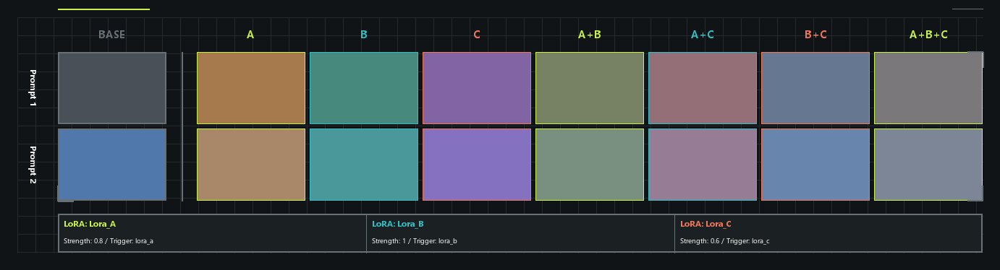
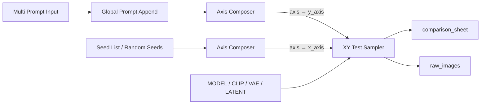

# ComfyUI LoRA Tester

[简体中文](README.md) | [English](README_EN.md)

ComfyUI nodes for LoRA, artist-tag, and extensible XY parameter testing. The sampler accepts `MODEL / CLIP / VAE / LATENT` directly and handles prompt encoding, model/CLIP patching, sampling, VAE decoding, and labeled comparison-sheet composition inside the node.



## Highlights

- Generic `XY Test Sampler`: combines any two `XY_AXIS` inputs and returns both a labeled `comparison_sheet` and a row-major `raw_images` batch.
- Prompt axis: splits a long prompt list, applies shared text before or after every prompt, and carries independent artist tags separately.
- Seed axis: parses an explicit seed list or deterministically generates random seeds from a source seed.
- Style axis: builds an axis from Style Stack, combination, and list nodes, representing LoRA and artist tags together. Headers show compact `weight-code` combinations; the footer only maps codes to source information.
- Generic axis composition: prompt lists, Style Stacks, Style Stack lists, and seed lists can all pass through `Axis Composer` to produce an orientation-neutral `XY_AXIS`.
- Dedicated LoRA testing: retains the specialized 1-3 LoRA weight-gradient and mixing layouts.
- Anima support: selects artist-tag templates from model configuration and can optionally route multi-artist cells through Anima Artist Mixer.
- Configurable output: black, white, and custom themes with background images, fonts, colors, spacing, decorators, categorized tables, and text notes.
- Bilingual node UI: Simplified Chinese and English through ComfyUI's native `locales` mechanism.

## Recommended Workflows

The primary "prompts on Y, seeds on X" workflow is:



For a horizontal style comparison:

```text
Style Stack -> Style Stack Splitter / Style Stack Lister -> Axis Composer -> axis -> x_axis
Multi Prompt Input -> Global Prompt Append                    -> Axis Composer -> axis -> y_axis
```

Every axis node exposes an output named `axis`. Axes are orientation-independent and may connect to either sampler input, `x_axis` or `y_axis`. `axis_title` is the heading for the entire axis; each row or column label comes from its own `AxisEntry.label`. `Axis Composer` can place a Style BASE entry in its own group with `include_base`, creating a visible gap before the remaining test entries. `Prompt Axis`, `Style Axis`, and `Seed Axis` remain available as typed convenience builders.

## Installation

Clone the repository into ComfyUI's `custom_nodes` directory:

```powershell
Set-Location D:\ComfyUI\ComfyUI_windows_portable\ComfyUI\custom_nodes
git clone https://github.com/Mon-Landis/LoraTester.git
..\..\python_embeded\python.exe -s -m pip install -r .\LoraTester\requirements.txt
```

For other installations, use the Python interpreter that runs ComfyUI:

```bash
python -m pip install -r ComfyUI/custom_nodes/LoraTester/requirements.txt
```

After installing or updating Python, `web`, or `locales` files, restart the ComfyUI backend and refresh the browser. LoRA files must be in a `models/loras` directory known to ComfyUI.

For development outside `custom_nodes`, the junction script creates a link only when the target does not already exist:

```powershell
powershell.exe -NoProfile -ExecutionPolicy Bypass -File .\scripts\link_to_comfy.ps1
```

## Node Overview

| Category | Node | Purpose |
|---|---|---|
| `Lora Tester/XY` | `XY Test Sampler` | Samples the Cartesian product of two axes and returns a sheet plus the original image batch. |
| `Lora Tester/XY/Prompt` | `Multi Prompt Input` | Builds a prompt list from a count control and separate input rows. |
| `Lora Tester/XY/Prompt` | `Global Prompt Append` | Adds shared text before/after every prompt and appends independent artist tags. |
| `Lora Tester/XY/Prompt` | `Prompt Axis` | Directly converts a prompt list into an orientation-neutral `XY_AXIS`. |
| `Lora Tester/XY/Style` | `Style Stack` | Configures up to 16 LoRA or artist-tag style entries. |
| `Lora Tester/XY/Style` | `Style Stack Splitter` | Produces every non-empty Style Stack combination. |
| `Lora Tester/XY/Style` | `Style Stack Lister` | Dynamically merges up to 16 individual Style Stacks. |
| `Lora Tester/XY/Style` | `Style Axis` | Directly converts a Style Stack list into grouped `XY_AXIS` data with detail tables. |
| `Lora Tester/XY/Seed` | `Seed List / Random Seeds` | Parses seeds or generates a deterministic random list. |
| `Lora Tester/XY/Seed` | `Seed Axis` | Directly converts a seed list into an orientation-neutral `XY_AXIS`. |
| `Lora Tester/XY/Axis` | `Axis Composer` | Converts any supported raw source or complete axis into a generic `axis`. |
| `Lora Tester` | `Style Component Tester` | Specialized 1-3 LoRA weight and mixing test. |
| `Lora Tester` | `LoRA Tester Style` | Supplies a custom visual style to samplers. |
| `Lora Tester/Artist Tags` | `Artist Tag Template` | Overrides normal and weighted artist-tag formatting. |
| `Lora Tester/Artist Tags` | `Anima Artist Mixer Configuration` | Configures the optional multi-artist Anima route. |
| `Lora Tester/Deprecated` | `Style Combination Tester` | Compatibility node for old prompt-horizontal workflows; use the generic XY nodes for new workflows. |

`Style Combination Tester` is deprecated, but its registration key and inputs remain available so existing workflows still load. It now reuses the generic XY sampling core. Do not use it for new workflows.

## XY Behavior and Limits

- An axis may contain up to 64 entries. Both axes cannot assign the same parameter, such as two seed axes or two prompt axes; the sampler rejects conflicts before model loading.
- Built-in handlers cover `prompt`, `seed`, `lora_stack`, `steps`, `cfg`, `sampler_name`, `scheduler`, and `denoise`. Prompt, seed, and style sources and convenience builders are exposed in the UI; `Axis Composer` provides their consistent generic entry point.
- Once composed, an axis supports whole-axis operations only and does not expose per-entry post-processing. Internal helpers already provide group-preserving concatenation and conflict-checked cross merging for future nodes.
- When the frontend can identify an axis source, it disables the corresponding base sampler control. Backend validation remains authoritative.
- `raw_images` is a ComfyUI `[N,H,W,C]` IMAGE batch in row-major `(y, x)` order. Group spacing and footer layout do not affect this order.
- The input latent must contain one sample. Large axes or latent dimensions produce non-blocking warnings. The final sheet is protected by a default `150 MP` `max_canvas_megapixels` limit.
- The original image batch consumes CPU memory. For large matrices and high resolutions, reduce axis lengths or latent dimensions before increasing the canvas limit.
- Non-empty `extra_footer_text` adds a final `NOTES` section. Style footers only show the code-to-source map; prompt bodies are not repeated below the sheet.

## Prompts and Artist Tags

Only the dedicated independent-artist field from `Global Prompt Append` enters the artist routing chain. `@tag` text in ordinary prompts and LoRA trigger words remains in the base prompt and is never extracted automatically.

Built-in model detection reads ComfyUI's resolved model configuration, not the checkpoint filename:

| Model | Default format |
|---|---|
| Anima | `@{tag}` / `(@{tag}:{weight})` |
| Other Danbooru-tag model families | `{tag}` / `({tag}:{weight})` |
| Connected `Artist Tag Template` | Uses the two templates defined by the node |

The project optionally integrates with [Anima-Artist-Mixer](https://github.com/An1X3R/Anima-Artist-Mixer). The external mixer is called only when the model is Anima, the current cell has at least two explicit artist entries, the mixer is available, and both the switch and configuration are enabled. Every other case uses native prompt encoding. A missing external project never prevents this plugin from importing or running.

Detailed boundaries and validation records:

- [Anima artist-weight linearity audit](audit/anima_artist_linearity.md)
- [Artist routing audit report](audit/artist_routing_report.md)

## Dedicated LoRA Tester

`Style Component Tester` is intended for quick single-weight and mixing checks across 1-3 LoRAs:

| LoRA count | Unique samples | Canvas positions |
|---:|---:|---:|
| 1 | 5 | 5 |
| 2 | 25 | 25 |
| 3 | 69 | 73, with reused single-axis images |

Each entry has `min_strength` and `max_strength`; the four multipliers are `0.25 / 0.5 / 0.75 / 1.0`:

```text
actual = min_strength + (max_strength - min_strength) * multiplier
```

At a non-zero effective weight, the LoRA is applied to both MODEL and CLIP and its trigger is added to the positive prompt. A low-weight cell is not a quality floor. Use a true zero-weight BASE cell for a stable base-model reference.


## Styling

`color_mode` supports `black / white / custom`. In `custom` mode, connect `LoRA Tester Style` to configure a background color or single background `IMAGE`, fitting mode, text/frame/A-B-C accent colors, spacing, fonts, and decorators. Styling affects only the comparison sheet, not `raw_images`.

Python integrations may also register a decorator implementing `draw_background()` and `draw_foreground()` through `register_style_decorator()`. See the [development and architecture guide](DEVELOPMENT.md) for module boundaries and APIs.

## Development and Verification

```powershell
powershell.exe -NoProfile -ExecutionPolicy Bypass -File .\scripts\run_tests.ps1
powershell.exe -NoProfile -ExecutionPolicy Bypass -File .\scripts\render_previews.ps1
powershell.exe -NoProfile -ExecutionPolicy Bypass -File .\scripts\check_environment.ps1
```

- [Development and architecture guide (Chinese)](DEVELOPMENT.md)
- [Preview and visual test assets](previews/)
- [Three-LoRA task manifest example](previews/3_lora_manifest.json)
